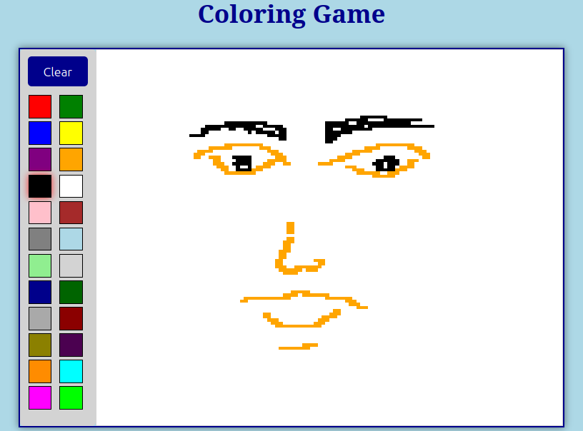

# 🎨 Coloring Game - Pixel Art Creator

A fun and interactive pixel art coloring game built with vanilla HTML, CSS, and JavaScript. Create beautiful pixel art drawings with a wide variety of colors!

## 🖼️ Demo



**[🎮 Try the Game Live!](https://coloring-game-di.netlify.app/)**

_Click the link above to play the game directly in your browser!_

## 📋 About This Project

This coloring game is a **mini-project** from the **Developer Institute Bootcamp** that I'm currently attending. It demonstrates fundamental web development concepts including:

- **DOM manipulation** with JavaScript
- **Event handling** (mouse events, click events)
- **CSS Grid** for layout structure
- **Interactive user interface** design
- **Responsive web design** principles

## 🎯 Features

- **Large Canvas**: 120x120 pixel grid (14,400 pixels) for detailed artwork
- **Rich Color Palette**: 24 different colors including:
  - Primary colors (red, blue, yellow, green)
  - Secondary colors (purple, orange, pink)
  - Neutral colors (black, white, gray variations)
  - Special colors (cyan, magenta, lime)
- **Mouse Drawing**: Click and drag to paint
- **Clear Function**: Reset button to start fresh
- **Visual Feedback**: Selected color highlighting with red glow effect
- **Responsive Design**: Works on different screen sizes

## 🚀 How to Play

1. **Select a Color**: Click on any color from the palette on the left
2. **Start Drawing**:
   - Click on any grid cell to color a single pixel
   - Click and drag to paint multiple pixels at once
3. **Create Art**: Build your pixel masterpiece!
4. **Clear Canvas**: Use the "Clear" button to reset and start over

## 🛠️ Technologies Used

- **HTML5**: Structure and layout
- **CSS3**: Styling, grid layout, and visual effects
- **JavaScript (ES6+)**: Interactive functionality and DOM manipulation

## 📁 Project Structure

```
Coloring_game/
├── index.html          # Main HTML file
├── style.css           # CSS styling and layout
├── script.js           # JavaScript functionality
└── README.md           # Project documentation
```

## 🎨 Technical Implementation

### Grid Creation

```javascript
// Creates a 120x120 grid dynamically
const createDrawingPad = function () {
  for (i = 0; i <= 120; i++) {
    for (j = 0; j <= 120; j++) {
      const div = document.createElement("div");
      colorGrid.append(div);
    }
  }
};
```

### Color Selection System

- Visual feedback with CSS box-shadow effects
- Dynamic class management for selected colors
- Event delegation for efficient color palette handling

### Drawing Mechanism

- Mouse down/up state tracking
- Mouseover events for drag painting
- Smooth painting experience with continuous drawing

## 📚 Learning Outcomes

Through this project, I practiced and learned:

- **Event Handling**: Managing multiple types of mouse events
- **DOM Manipulation**: Creating elements dynamically and modifying styles
- **CSS Grid**: Creating responsive layouts and pixel-perfect grids
- **User Experience**: Designing intuitive interfaces
- **Code Organization**: Structuring JavaScript for maintainability

## 🔧 Installation & Setup

### Option 1: Direct Download

1. Clone or download this repository
2. Open `index.html` in your web browser
3. Start creating pixel art!

### Option 2: Local Development

```bash
# Clone the repository
git clone https://github.com/BiiN12/DI-Bootcamp.git

# Navigate to the project
cd DI-Bootcamp/week03/day5/Mini-projects/Coloring_game

# Open in your browser
open index.html
# or
python -m http.server 8000  # For local server
```

## 🎯 Future Enhancements

Potential improvements for future versions:

- [ ] Color picker for custom colors
- [ ] Save/load artwork functionality
- [ ] Different brush sizes
- [ ] Undo/redo functionality
- [ ] Export as image file
- [ ] Gallery of saved artworks
- [ ] Zoom functionality for detailed work
- [ ] Color bucket fill tool

## 👨‍💻 About the Developer

This project was created as part of my learning journey at the **Developer Institute Bootcamp**. I'm passionate about web development and enjoy creating interactive applications that combine creativity with programming.

**Connect with me:**

- GitHub: [@BiiN12](https://github.com/BiiN12)
- Check out more of my projects in the [DI-Bootcamp repository](https://github.com/BiiN12/DI-Bootcamp)

## 📜 License

This project is part of the Developer Institute Bootcamp curriculum and is intended for educational purposes.

---

### 🎉 Enjoy Creating Pixel Art!

Feel free to experiment, create amazing artwork, and don't forget to have fun! If you create something cool, I'd love to see it! 🎨✨

_Made with ❤️ during my Developer Institute Bootcamp journey_
